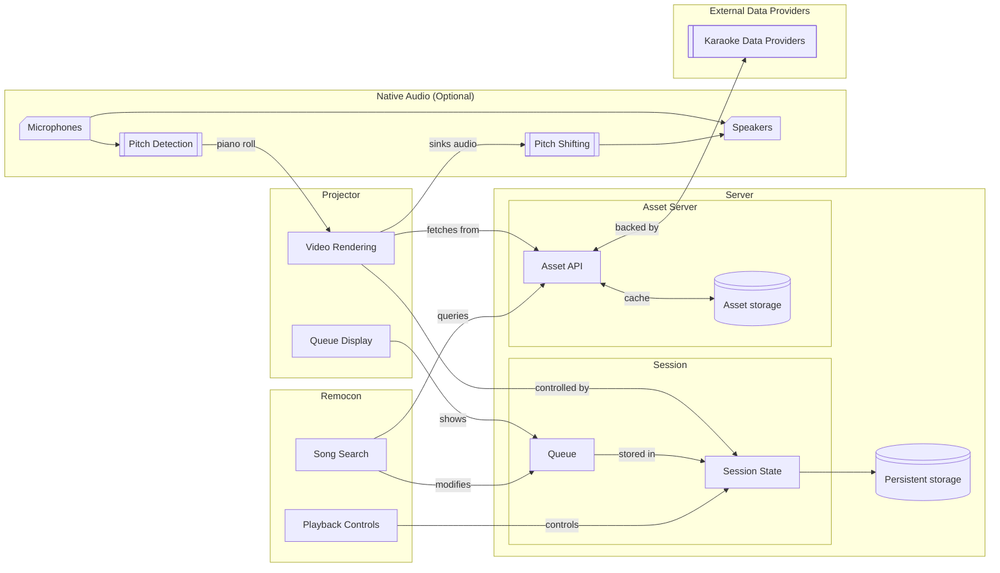

# KF2 Architecture

KF2 is comprised of four main components:
- The server process, running locally or remotely, which stores session state, interacts with upstream data providers, and exposes various session management APIs. The server process also serves the various user-facing interfaces.
- The projector single-page app, which renders the karaoke video, lyrics, and any other ancillary information as necessary (e.g. the queue, the remocon QR code).
- The remocon single-page app, which allows users to control playback and manage the song queue.
- The optional native audio helper, designed to be run alongside the projector single-page app. The process handles microphone monitoring, pitch analysis, and advanced audio processing (e.g. VSTs, pitch shifting).

# Design Philosophy by Component

## Backend Server

- The backend server should never (or rarely) crash. If it does, no state should be lost or corrupted to a state that requires manipulation outside the boundaries of the UI (via API).
- The backend server should be solely responsible for the state of a session, beyond the scope of playing a single song.
- As much as possible, complex manipulation and logic should happen within the backend. However, the UI should still be responsive and provide the user with sufficient feedback as to the status of their request. Whenever possible, long-running operations should be asynchronous and idempotent.

## Projector

- The projector should itself be relatively stateless.
- All state should be fetched from the backend, and the backend should be responsible for ensuring that each session only has one active projector instance.

## Remocon

- Similar constraints on maintaining state to the projector, however, per-user settings may be stored in local storage.

## Native Audio Helper

- Low audio latency is key to the karaoke experience. As such, wherever possible, parameters should be configured such that the lowest possible audio latency is achieved, while also keeping stability in mind.
- It may be necessary to manually adjust parameters to achieve low latency. To this end, the native audio helper should provide sufficient instrumentation to allow an experienced user to make the appropriate decisions.
- Native, platform-specific code interfacing with low-level audio APIs can be complex and hard-to-verify. To counteract this, the helper should be designed in a modular fashion that allows components to be mocked out for easier testing.